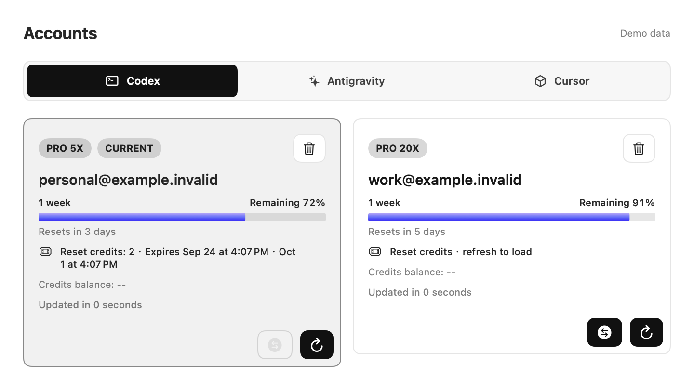
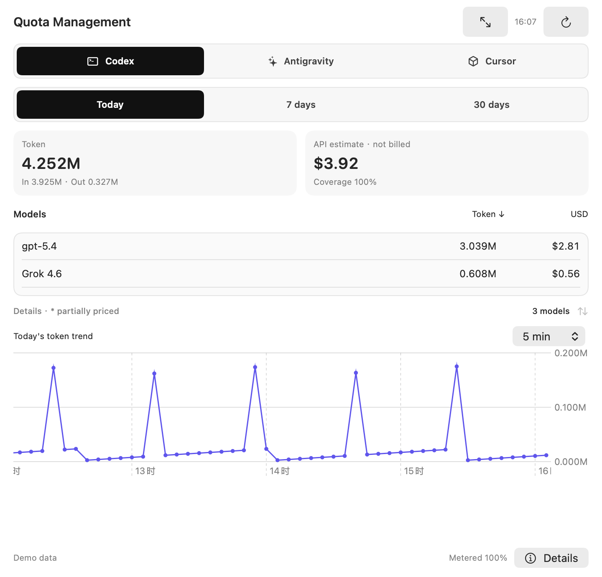
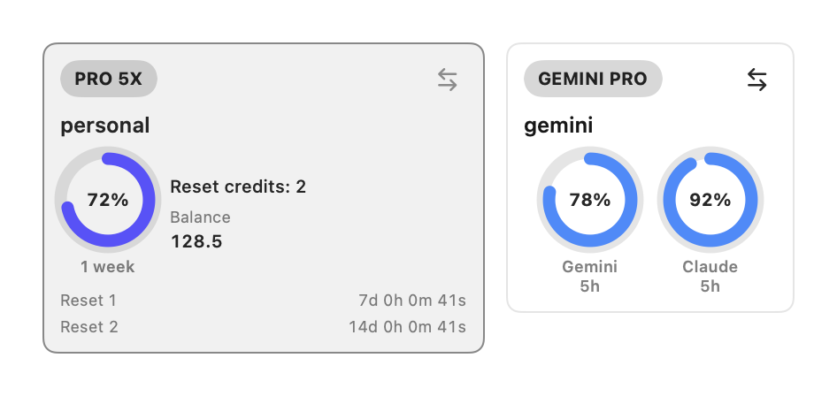

<p align="center">
  
</p>

<h1 align="center">AILSA SubSwitch</h1>
<p align="center"><strong>Weekly usage at a glance. Switch accounts in a click.</strong></p>
<p align="center">A native macOS menu bar app for Codex, Antigravity, and Cursor.</p>
<p align="center">
  
  
  <a href="LICENSE"></a>
</p>
<p align="center">
  <a href="#get-started">Get started</a> ·
  <a href="docs/USER-GUIDE.md">User guide</a> ·
  <a href="docs/PRIVACY.md">Privacy</a> ·
  <a href="CONTRIBUTING.md">Contribute</a>
</p>

Keep your coding accounts and their remaining usage in one place. See which
account is ready, switch to it, and understand where your recorded usage went—
without leaving the menu bar.

AILSA SubSwitch is designed to be one of the most user-focused and visually
considered products in its category. The project treats interaction details,
readability and visual polish as product features, so usage information stays
clear without making the menu bar feel like an operations console.

The open-source project includes at least two free progress-bar skins. Future
releases may add paid skins and other advanced user-experience improvements,
while the core features remain free throughout the 1.x series.

AILSA SubSwitch is an independent, community-maintained project. It is not
affiliated with OpenAI, Google, Anysphere, or the providers whose usage it
displays. The application includes code derived from
[Copool](https://github.com/AlickH/Copool), with attribution and notices
preserved in this repository.

## What you can do

- **Switch accounts.** Save local sign-ins for Codex / ChatGPT, Antigravity and
  Cursor, see the active account, and switch from an account card. More service
  providers are planned for future releases.
- **Read the actual limits.** View provider-reported usage windows and reset
  times, with Codex reset-credit counts and expirations when reported.
- **Follow usage over time.** Explore Today, 7-day and 30-day views, model
  breakdowns, and an intraday point-and-line chart with hover details and
  horizontal trackpad navigation.
- **Understand reference costs.** Read token records from local Codex sessions
  or the OpenCodex ledger, including supported non-OpenAI routes. Keep API
  reference estimates separate from provider-reported amounts and billing.
- **Make it yours.** Choose M/B token units, visible usage windows, restart
  behavior after switching, and the interface language. Open usage in its own
  window when you need more room.

### Provider support

| Capability | Codex / ChatGPT | Antigravity | Cursor |
| --- | --- | --- | --- |
| Local account import and switching | Yes | Yes | Yes |
| Usage and reset times | Provider-reported | Native usage families | Provider-reported |
| Token / USD details | Local sessions or OpenCodex records | Not exposed by the supported usage source | Usage events reported by Cursor |
| History | Recorded usage | Locally captured usage snapshots | Reported usage events |
| Smart switching | Supported | Available when native credential access permits | Manual switching |

Unknown usage or pricing remains unknown. **API reference cost is not your
subscription bill, credit balance, or a promise of what a provider will charge.**
Antigravity usage percentages are not converted into invented token totals.

We expect to add Grok and Kimi usage monitoring in **1.0.1**, followed by
Alibaba and DeepSeek usage monitoring in **1.0.2**.

**1.0.0(a)** adds Grok 4.7 model grouping and official API reference pricing for
recorded usage, including cached input, long context and confirmed Priority
processing. This is separate from the planned Grok subscription monitor.
It also fixes Antigravity 2.15.1 OAuth configuration detection, with structural
validation for newer Google-signed builds. See the [update notes](docs/RELEASE-1.0.0a.md).

## Preview

Actual SwiftUI components, rendered with **synthetic demo accounts and usage**.
The sample numbers are illustrative, not provider prices or a real account's bill.





Compact cards keep usage-family names visible and show Codex reset-credit details:



Regenerate these previews with `bash scripts/render_docs.sh`; the renderer does
not load your live account library.

## Get started

**Requirements:** macOS 14 or later, an Apple Silicon Mac, and an existing sign-in
for each provider you want to use. Provider subscriptions are separate from
AILSA SubSwitch.

1. Download the macOS ZIP from [Releases](https://github.com/KZCFG/AILSA-SubSwitch/releases) once the
   1.0.0 package is published. You do not need Xcode to use a prebuilt package.
2. Move **AILSA SubSwitch.app** to **Applications** and open it.
3. Click its menu bar icon. In **Accounts**, select a provider and import the
   current sign-in. Sign into another account in the provider's own app and
   import that account to save it for later switching.
4. Open **Usage Management** for recorded usage. Use **Settings** to choose
   which limits are visible, the compact ring order, progress skin, reset-credit
   date format, and whether provider apps restart after a switch.

**1.0.0 distribution:** manual downloads, no OTA updater and no App Store
submission. The package is ad-hoc signed and is not Apple-notarized. macOS may
require an explicit first-open approval in **System Settings → Privacy &
Security**. See the [installation guide](docs/USER-GUIDE.md#install-and-update).
Do not disable system-wide security protections to run it.

When updating, quit AILSA SubSwitch and replace the application bundle. Account data is
stored separately. This version does not install updates in the background.

## Usage sources and privacy

AILSA SubSwitch does not operate an account-sync service or collect analytics. It reads
local account/usage files and contacts the relevant providers for sign-in and
usage information. Some saved profiles contain credentials; they are not public
project files and should never be attached to an issue.

| Source | Used for |
| --- | --- |
| Codex local authentication and session metadata | Switching, usage, recorded token usage |
| OpenCodex local usage ledger, when present | Model/provider usage and separately identified reference estimates |
| Antigravity native session and usage source | Google account switching and usage snapshots |
| Cursor local profile and usage API | Cursor switching and usage events |

Read [Privacy & data](docs/PRIVACY.md) for storage locations, network behavior and
what to redact in bug reports. AILSA SubSwitch does not provide an API relay or bundle a
model backend.

## Build from source

The supported packaging path uses **Xcode Command Line Tools** and Python 3;
no package-manager dependencies or previously installed AILSA SubSwitch binary are required.

```bash
# On an Apple Silicon Mac:
git clone https://github.com/KZCFG/AILSA-SubSwitch.git
cd AILSA-SubSwitch
bash scripts/build_app.sh
```

Output: `build/1.0.0(a)-2026092201/AILSA SubSwitch.app`, an arm64 ZIP, SHA-256 checksum,
and source manifest. Check [build and release notes](docs/release-macos.md) for
custom output locations and signing details.

The project page and app use the same AILSA SubSwitch artwork. After replacing
`docs/assets/app-icon.png`, run `bash scripts/build_icon.sh` to regenerate the
macOS icon, then build the app.

```bash
bash scripts/sync_version.sh --check
bash scripts/run_tests.sh --isolate
```

The portable test runner uses an asserting XCTest-compatible shim on Command
Line Tools-only machines; it is **not Apple's XCTest runtime** and reports only
the tests it actually executes. See [Contributing](CONTRIBUTING.md).

## Status and limitations

- 1.0.0 release preparation; publication and release artifacts are tracked in
  [the release checklist](docs/RELEASE-CHECKLIST.md).
- Apple Silicon is the validated packaging target. Intel builds and widgets
  on clean machines need additional validation.
- Provider endpoints and local sign-in formats can change. Expired sign-ins
  require provider reauthentication; macOS may request Keychain authorization.
- Stable Developer ID signing and OTA updates are deferred. Repeated Keychain
  authorization across development builds is not claimed to be solved.
- Eleven localization catalogs are included; some newer controls still need
  translation work. The public project documentation is maintained in English.

## Contributing

Bug reports, reproducible fixtures, UI feedback, translations and code reviews
are welcome. Start with [Contributing](CONTRIBUTING.md), [the user guide](docs/USER-GUIDE.md)
and the [roadmap](docs/ROADMAP.md). For credential or account-safety issues, use
[the security policy](SECURITY.md) instead of posting secrets publicly.

## Credits and license

Released under the [MIT License](LICENSE), with the upstream copyright notices
preserved.

- [Copool](https://github.com/AlickH/Copool): the Swift application foundation
  and account-management architecture.
- [codex-tools](https://github.com/170-carry/codex-tools): Copool's upstream
  project and preserved attribution.
- [CodexBar](https://github.com/steipete/CodexBar): adapted progress-bar structure
  and provider-integration references.
- OpenCodex: an optional external usage-data source; its runtime is not bundled.

See the [third-party notices](Sources/AILSA_SS/Resources/THIRD_PARTY_NOTICES.md)
and [provenance notes](docs/PROVENANCE.md) for the boundaries of reuse. Provider
names and marks belong to their respective owners.
